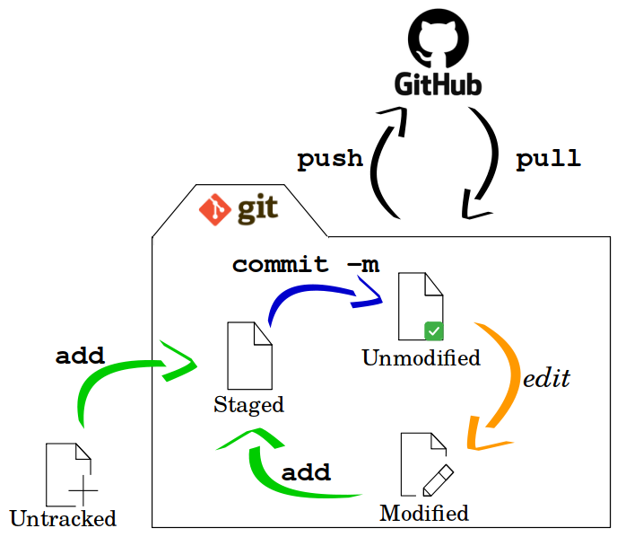

#

# Ferramenta de Versionamento


Uma **ferramenta de versionamento** (ou sistema de controle de versão - VCS) é um software utilitário essencial no desenvolvimento de sistemas computacionais que tem como função principal **gerenciar os arquivos de código-fonte e rastrear cada alteração feita no projeto**.

Os principais aspectos dessas ferramentas são:

## 1. Funcionalidades Principais

*   **Rastreamento de Mudanças:** O sistema registra quem fez a alteração, o que foi alterado e quando isso ocorreu. 
*   **Trabalho Colaborativo:** Permite que várias pessoas trabalhem no mesmo código simultaneamente, facilitando a **mesclagem (merge)** das alterações em uma base de código mestra (*master code base*).
*   **Histórico do Projeto:** Possibilita acompanhar o crescimento do projeto ao longo do tempo e, se necessário, reverter para versões anteriores caso surjam problemas.

## 2. Conceitos Fundamentais
*   **Commit:** É a unidade básica de mudança, consistindo em uma "fotografia" dos arquivos modificados e as alterações internas de código.
*   **Repositório:** O local onde o código e todo o seu histórico de revisões ficam armazenados.
*   **Clone e Fork:** Um *clone* é uma cópia local do repositório no computador do desenvolvedor; um *fork* é uma cópia oficial online do repositório vinculada à conta do próprio usuário.

## 3. Ferramentas Populares

*   **Git:** Atualmente é o sistema de controle de versão mais poderoso e utilizado, sendo um sistema **completamente distribuído**. É a ferramenta preferida por aproximadamente **76% dos profissionais brasileiros** de sistemas embarcados, de acordo com pesquisa de 2025 do portal Embarcados.
*   **GitHub:** É uma comunidade online de compartilhamento de código que utiliza o Git como base para gerenciamento social de software.
*   **Outras ferramentas:** Sistemas mais antigos ou alternativos são **CVS** e **Subversion (SVN)**.


## 4. Fluxo de trabalho com git e GitHub

| Fluxo simples de trabalho com git e GitHub |
| :----------------------------------------: |
|  |
|            Fonte: Autor                    |

---

## 5. Passo a Passo do Início ao Fim da Sessão

Início da Aula / Sessão de Trabalho

**Verifique se o Git está instalado**: Abra o terminal (Git Bash, Prompt de Comando ou Terminal do VS Code) e digite:

``` Bash
git --version
```

**Configure seu usuário temporário**: Essas configurações serão apagadas ao reiniciar, então você precisará fazer a cada sessão:

``` Bash
# Define nome de usuário global
git config --global user.name "Seu Nome"

# Define e-mail global, o mesmo usado no github
git config --global user.email "seu.email@exemplo.com"
```


**Clone o seu repositório**: Escolha uma pasta temporária para trabalhar (ex: Área de Trabalho ou pasta Documentos):

``` Bash
# Clona o repositório de projeto do github para o diretório local atual
git clone https://github.com/seu-usuario/seu-repositorio.git

# Acessa o repositório do projeto clonado
cd seu-repositorio
```

**Durante o Trabalho**: Faça o commit com frequência à medida que concluir pequenas partes das tarefas:
    
``` Bash
# Verifica o status das alterações e arquivos rastreados
git status

# Adiciona todos os arquivos modificados ao Staging area
git add .

# Registra as modificações com uma mensagem descritiva
git commit -m "Descrição das alterações realizadas"
```

**Antes de Encerrar a Sessão** e/ou desligar o Computador: **Passo Crítico!**

Antes de sair ou do computador reiniciar, envie obrigatoriamente todas as alterações para o GitHub, fazendo o *Push* das alterações:

``` Bash
# Envia alterações para o repositório remoto (github)
git push origin main
```

Substitua main pelo nome da sua branch, se estiver usando outra, como master ou dev.

Autenticação: Ao dar o git push, o GitHub solicitará autenticação. Você pode autenticar via navegador ou fornecendo um Personal Access Token (PAT) em vez da sua senha tradicional.

Verificação no navegador: Acesse github.com pelo navegador do computador ou do celular e confirme se os seus novos commits e arquivos realmente aparecem no repositório.


---

# Referências

1. MARWEDEL, Peter. **Embedded System Design: Embedded Systems Foundations of Cyber-Physical Systems, and the Internet of Things.** 4. ed. Dortmund: Springer Nature, 2021.

2. ANDERSON, Rick; CERVO, Dan. **Pro Arduino: Arduino Expert Topics and Techniques.** New York: Apress, 2013.

3. **EMBARCADOS. Pesquisa sobre o Mercado Brasileiro de Sistemas Embarcados e IoT 2025.** [S. l.]: Embarcados, 2025. Disponível em: https://embarcados.com.br/relatorio-da-pesquisa-sobre-o-mercado-brasileiro-de-sistemas-embarcados-e-iot-2025/


---
