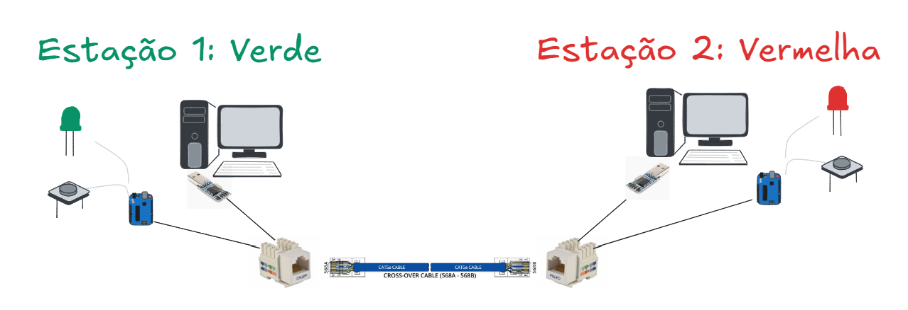

# Lab. 04 - Rede ponto a ponto

---

## Objetivo

Executar a comunicação de acordo com a arquitetura da ilustração, entre duas estações, de modo que uma estação monitore e comande, respectivamente, a chave e o led, da outra estação.

**Desafios:**

1. Definir em conjunto (equipes das duas estações):
      - Um comando para a leitura da chave/contato, representando o sinal digital de entrada;
      - Um comando para o acionamento do led, representando o sinal digital de saída (um comando para ligar e outro para desligar o led);
      - Os parâmetros de comunicação, tais como velocidade de comunicação (baud rate), paridade, stop bits;
      - A pinagem para o cabo de comunicação entre as estações.

2. Elabore um relatório, por equipe, contendo:
      - Identificação dos integrantes;
      - Estrutura do trabalho (introdução, materiais, desenvolvimento, conclusão);
      - Diagrama simplificado de conexões;
      - Configuração de comunicação;
      - Configuração do cabo de comunicação;
      - Programa executado no Arduino;
      - Tabela de comandos;
      - Captura, via osciloscópio, dos sinais de comando para a leitura da chave e escrita no LED. 
      - Competências desenvolvidas;
      - Habilidades trabalhadas;
      - Dificuldades encontradas;
      - Salvar em formato .pdf;
      - Enviar no e-mail: jose.pereira@ifsp.edu.br
      - Data limite para nota completa: 29/09/2025
          - Após esta data: nota = avaliação - 0,1 * dias_em_atraso;

---
