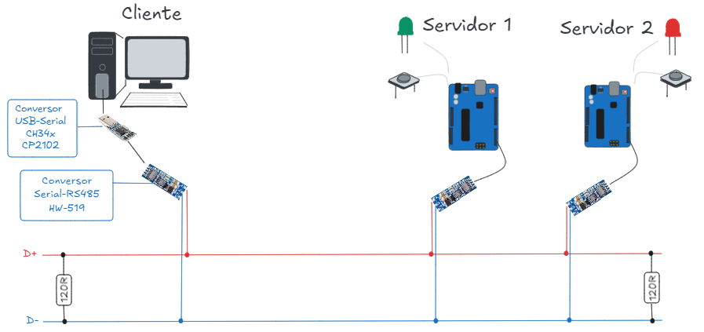

# Lab. 05 - Rede multiponto - RS485

---

## Objetivo

Executar a comunicação de acordo com a arquitetura da ilustração, de modo que uma estação cliente monitore e comande, respectivamente, a chave e o led, dos servidores 1 e 2.

**Desafios:**

1. Definir em conjunto (duas equipes):
      - Um comando para a leitura da chave/contato, representando o sinal digital de entrada;
      - Um comando para o acionamento do led, representando o sinal digital de saída (um comando para ligar e outro para desligar o led);
      - Os parâmetros de comunicação, tais como velocidade de comunicação (baud rate), paridade, stop bits.
      

2. Elabore um relatório, por equipe, contendo:
      - Identificação dos integrantes;
      - Estrutura do trabalho (introdução, materiais, desenvolvimento, conclusão);
      - Diagrama simplificado de conexões;
      - Configuração de comunicação;
      - Configuração do cabo de comunicação;
      - Programa executado no Arduino;
      - Tabela de comandos;
      - Captura, via osciloscópio, dos sinais de comando para a leitura da chave e escrita no LED. 
      - Competências desenvolvidas;
      - Habilidades trabalhadas;
      - Dificuldades encontradas;
      - Salvar em formato .pdf;
      - Enviar no e-mail: jose.pereira@ifsp.edu.br
      - Data limite para nota completa: 06/10/2025
          - Após esta data: nota = avaliação - 0,1 * dias_em_atraso;

---

- [HW-519 - UsinaInfo](https://www.usinainfo.com.br/conversores-de-sinal/conversor-ttl-para-rs485-hw-519-8683.html)
- [HW-519 - SmartKits](https://www.smartkits.com.br/modulo-conversor-rs485-para-ttl-hw-519?srsltid=AfmBOoopJOkpyqKDKkOt0O97tDmmy963VmeO2aJ9xd9TrkQYtE9wPwRe)
---
