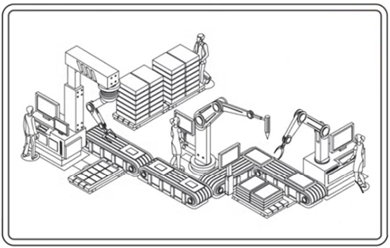

A **automação industrial** é o conjunto de **implementações técnicas**,
que permitem a **execução parcial ou total de forma automática** de
**máquinas ou processos industriais**.

A automação industrial **usa de tecnologias capazes de operar processos com pouca ou
nenhuma intervenção humana**, em aplicações tradicionalmente industriais mas atualmente também em residenciais e comerciais.

Pode ser atribuída à **segunda revolução industrial** o **nascimento da automação industrial**, como a conhecemos, mas os marcos anteriores foram fundamentais para o seu surgimento e desenvolvimento.

A **primeira revolução industrial**, **substituiu** a produção **manufatureira por máquinas**,
possibilitando a **padronização** e aumentando drasticamente a **escala** de produção,
**reduzindo preços** e aumentando a classe consumidora,
**aumentando** assim o **lucro** dos donos das fábricas.

As máquinas que impulsionaram a produção neste momento eram à vapor, que no **século XIX** foram substituídas por máquinas elétricas graças à invenção do **motor elétrico**.
Da mesma forma, outros dispositivos elétricos puderam ser desenvolvidos, proporcionando um maior **controle no acionamentos** de máquinas, inclusive com **temporizadores, sistemas de intertravamento e proteção**.

Já com a **terceira revolução industrial**, ocorrida em meados do século XX,
a revolução digital, após a invenção do **circuitos integrados** e da computação,
permitiu o desenvolvimento de controladores com alto poder de **processamento**,
sensores e atuadores precisos.
A **comunicação entre equipamentos** melhorou drasticamente, permitindo ganhos substanciais na gestão de processos, através de comandos e acompanhamentos precisos e eficientes.

Toda a infraestrutura para uma automação industrial de alta performance já era possível, mas a **quarta revolução industrial** trouxe um ganho de eficiência com a utilização de **inteligência artificial**, mudando a perspectiva da **tomada de decisão**, que agora é **baseada em dados** obtidos de forma massiva de todos os elementos dos processos produtivos, trazendo ganhos substanciais com uma **integração** profunda, **manufatura modular**, operação em **tempo real** e elevado grau de **otimização**.

Atualmente, um profissional da área de automação industrial, deve possuir **competências multidisciplinares**, desde a **programação** de controladores, **configuração** de servomecanismos, **acoplamentos e transmissões** mecânicas, **rede de comunicação**, dispositivos de acionamento e sensores, bem como o funcionamento específico de máquinas ou de processos;
Suas responsabilidades perpassam as tarefas de **projetar, executar, planejar, instalar, realizar manutenções e testes** nos **sistemas de controle e automação das máquinas e dos processos industriais**.

A **integração** dessas diversas tecnologias, de forma sincronizada, coerente e **lógica**, permite **ganhos de produtividade, agilidade, qualidade**, e a **redução** de indicadores como **custo, falhas e não conformidades**.

Frente à natureza plural e interdisciplinar, novas disciplinas se utilizam de recortes e colagens de conteúdos e competências de diversas disciplinas tradicionais, tais como mecânica, pneumática, hidráulica, elétrica, eletrônica, computação e gestão, necessárias para iniciar a formação de um profissional com as competências necessárias para atuação em automação industrial.

---

# Aulas SAUT

| Aula | Título | Conteúdo | Material complementar |
| ---- | ------ | -------- | --------------------- |
| 00   | [Apresentação](automacao/saut/slides/Aula00-Apresentacao.pdf) | - Ementa; - Objetivos; - Conteúdo Programático; - Bibliografia - Avaliação | [Mecatrônica - IFSP Salto](https://slt.ifsp.edu.br/index.php/component/content/article?id=1677) |
| 01   | [Automação Industrial](automacao/saut/slides/Aula01-SistemasDeAutomacao.pdf)  | - Definição; - A revolução industrial e a automação;; - O profissional; - As tecnologias. | 1. [LabDeEletronica - Uma Viagem Pela História da Automação.](https://youtu.be/Jkpp9f2mo38?si=TXCpzE3Cm89qrKbR) 2. [Telecurso 2000 - Automação - 01 Introdução a automação](https://youtu.be/Cnh1VyvbpJU?si=NRzWblOgxs17JwNc) |
| 02 | [Controlador Lógico Programável](automacao/clp/index.md) |  |  |
| 03 | [Redes Industriais](automacao/saut/slides/aula00-redes_industriais-SAUT.pdf)      |           |           |
