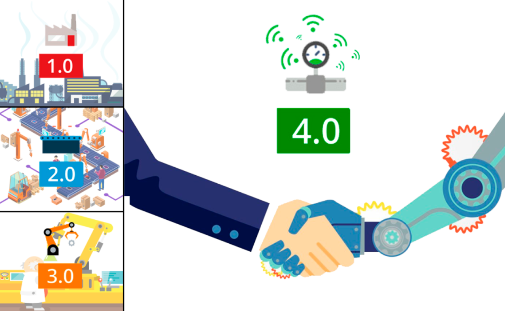
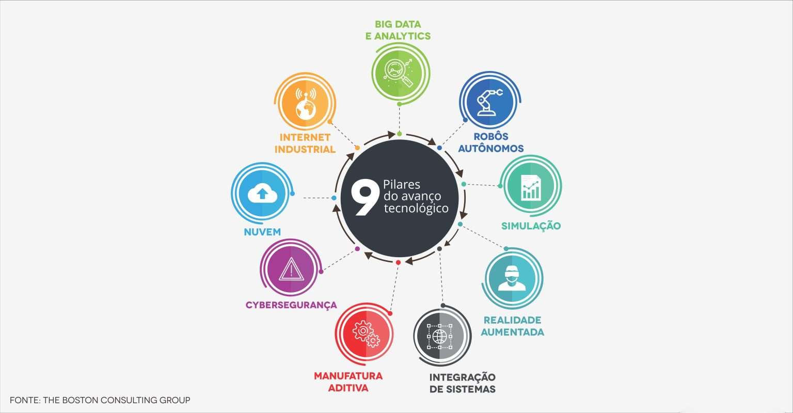

# Ciência de Dados e a Indústria 4.0

Todas as revoluções industriais apresentam drásticas mudanças no cenário produtivo, 
desde a utilização das primeiras máquinas à vapor, a eletrificação, 
a automação (Figura 1) e não seria diferente na sua quarta versão, 
também chamada de Indústria 4.0, em que alguns novos pilares foram inseridos 
transformando o modo interação entre a matéria prima, as máquinas e a mão de obra. 

Todas as inovações agregadas aos processos produtivos trazem grandes desafios, 
afetando o modo de vida em aspectos econômicos, social e cultural de praticamente todo o 
mundo globalizado. 

De acordo com Klaus Schwab, _“Moldar a quarta revolução industrial para garantir que ela 
seja empoderadora e centrada no ser humano – em vez de divisionista e desumana – 
não é uma tarefa para um único interessado ou setor, nem para uma única região, 
ou indústria ou cultura. Pela própria natureza fundamental e global dessa revolução, 
ela afetará e será influenciada por todos os países, economias, 
setores e pessoas”_ (A quarta revolução industrial. São Paulo. Edipro, 2016).

| Figura 1: As revoluções industriais                                     |
| :---------------------------------------------------------------------: |
|                          |
| Fonte: [9 PILARES TECNOLÓGICOS DA INDÚSTRIA 4.0 - OPENCADD](https://www.opencadd.com.br/blog/9-pilares-da-industria-4-0) |

Os pilares que sustentam a quarta revolução industrial, 
de acordo com o *The Boston Consulting Group*, estão ilustrados na Figura 2, 
em que a **Integração de Sistemas** talvez seja um elemento de central importância na 
fusão das tecnologias e seu emprego orquestrado na melhoria da eficiência da produção 
industrial, possibilitando a comunicação de forma horizontal entre equipamentos e 
vertical entre níveis de organização e gestão. 

O uso de **Simulações** em tempo real, 
criando um produto digital ou mesmo uma replica digital de uma máquina ou linha de produção, 
gêmeo digital, testando hipóteses e auxiliando o desenvolvimento e manutenção dos equipamentos.

A customização levada ao nível de um elemento de produção por lote se faz possível, 
principalmente com as técnicas de **manufatura aditiva**, 
trazendo um ganho fenomenal em flexibilidade da produção. 

A **Realidade aumentada** traz um grande potencial, principalmente nos setores de 
manutenção e treinamento, possibilitando inserir sobre o mundo real, 
projeções que servem de informação ou orientação para procedimentos, sejam na área médica, 
educacional ou industrial.

A linha de produção, muitas vezes, composta de robôs autônomos, trazendo maior uniformidade, 
flexibilidade e velocidade para a produção, utilizando parâmetros produzidos por 
algoritmos de inteligência artificial. 

| Figura 2: Pilares do avanço tecnológico                                     |
| :--------------------------------------------------------------------------:|
|                      |
| Fonte: [Transformação Digital na Indústria 4.0 - Fluxo](https://fluxoconsultoria.poli.ufrj.br/blog/industria4/) |

A integração horizontal no chão de fábrica é possível, inclusive, 
devido ao desenvolvimento do que chamado de **Internet das coisas**, 
em que os diversos dispositivos nos diversos níveis hierárquicos no chão de fábrica, 
conseguem se comunicar, prioritariamente através de servidores em **Nuvem**. 
Sendo esses locais centros de armazenamento e processamento do grande volume de dados, 
**Big Data**, em um servidor que não é mais associado fisicamente à fabrica, 
sendo agora um serviço oferecido por outras empresas especializadas em serviços de 
computação em nuvem, retirando essa carga de uma equipe de tecnologia de informação e 
uma central de processamento de dados local, com todos os requisitos de 
disponibilidade e segurança (**Cybersegurança**) sob responsabilidade desses provedores. 

Todo o conjunto massivo de dados é analisado (**Analytics**) através de algoritmos de 
inteligência artificial e produz parâmetros para tomada de decisão de forma a 
interferir nos processos locais ou mesmo corporativos. 

Em todos os processos há produção de dados, que podem ser relevantes ao processo, 
por isso são armazenados e analisados, gerando descobertas e produção de informações 
relevantes à melhoria do processo produtivo. Devido a sua centralidade e importância, 
os dados se tornaram o sinônimo de máteria-prima desta revolução, a era dos dados, 
a era da informação, sendo o seu volume impossível de ser analisado de forma tradicional, 
por cientistas de dados, faz-se necessário desenvolvimento de algoritmos que 
consigam analisar um volume tão grande de dados, de forma a extrair as informações 
relevantes de forma automática, e por isso a grande relevância e importância da 
inteligência artificial e técnicas de aprendizado de máquina tão presentes nas 
tecnologias contemporâneas. 

**Referências e complementos**

1. [Ind4.0 - Manufatura avançada](https://www.industria40.ind.br/)
2. [Código Fonte TV - CEO TROCA TODO TIME DE DEVS POR INTELIGÊNCIA ARTIFICIAL.](https://youtu.be/evVaZeysQKo?si=4Ee1ZUB_Bt8y1-4U)
3. [9 PILARES TECNOLÓGICOS DA INDÚSTRIA 4.0 - OPENCADD](https://www.opencadd.com.br/blog/9-pilares-da-industria-4-0)
4. [Transformação Digital na Indústria 4.0 - Fluxo](https://fluxoconsultoria.poli.ufrj.br/blog/industria4/)

---

## Aulas TAA

| Aula |Título | Conteúdo  | Material complementar |
| :--: | ----- | --------- | --------------------- |
|    0 | [Apresentação da disciplina](dados/slides/Aula00-apresentacao.pdf) |- Ementa;   - Objetivos   - Conteúdo programático   - Bibliografia   - Avaliação | [Engenharia de Controle e Automação - PPC 2029](https://nextcloud.slt.ifsp.edu.br/nextcloud/index.php/s/n7YQrbWs9K9cEwL) |
| 1 | [Indústria 4.0](dados/slides/Aula01-Industria4_0.pdf) | - Revoluções Industriais   - Pilares tecnológicos | 1. [Ind4.0 - Manufatura avançada](https://www.industria40.ind.br/)   2. [Código Fonte TV - CEO TROCA TODO TIME DE DEVS POR INTELIGÊNCIA ARTIFICIAL.](https://youtu.be/evVaZeysQKo?si=4Ee1ZUB_Bt8y1-4U)   3. [9 PILARES TECNOLÓGICOS DA INDÚSTRIA 4.0 - OPENCADD](https://www.opencadd.com.br/blog/9-pilares-da-industria-4-0)   4. [Transformação Digital na Indústria 4.0 - Fluxo](https://fluxoconsultoria.poli.ufrj.br/blog/industria4/)   5. [A história da inteligência artificial - TecMundo](https://www.tecmundo.com.br/mercado/135413-historia-inteligencia-artificial-video.htm) |
| 2 | [Inteligência Artificial](dados/slides/Aula02-InteligenciaArtificial.pdf) | - Inteligência Artificial   - Machine Learning   - Redes Neurais | 1. [Artificial Intelligence Coined at Dartmouth](https://home.dartmouth.edu/about/artificial-intelligence-ai-coined-dartmouth)   2. [Qual é a Diferença entre Inteligência Artificial, Machine Learning e Deep Learning? 10 de março de 2021 por Michael Copeland - Blog NVIDIA)](https://blog.nvidia.com.br/blog/qual-e-a-diferenca-entre-inteligencia-artificial-machine-learning-e-deep-learning/)   3. [A história da inteligência artificial - TecMundo](https://www.tecmundo.com.br/mercado/135413-historia-inteligencia-artificial-video.htm)   4. [O que é aprendizado de máquina (ML)? - IBM](https://www.ibm.com/br-pt/topics/machine-learning)   5. [A Friendly Introduction to [Deep] Neural Networks - August 23, 2021 - Kathrin Melcher - KNIME](https://www.knime.com/blog/a-friendly-introduction-to-deep-neural-networks) |
| 3 | [Ciência de Dados](dados/slides/Aula03-CienciadeDados.pdf) | - Análise de dados   - Tipos de Análise de dados   - Análise Descritiva   - Análise Diagnóstica   - Análise Preditiva   - Análise Prescritiva | 1. [Kaggle - Forecasting Future Passengers w/ PyCaret](https://www.kaggle.com/code/caesarmario/forecasting-future-passengers-w-pycaret)   2. [Esses são os 5 PASSOS para fazer uma ANÁLISE DE DADOS - Comunidade DS](https://youtu.be/-zHK3e45cI8?si=mk_jM-flgaAbkbJq)   3. [Data Viking - Odemir Depieri Jr](https://www.dataviking.com.br/post/tipos-de-analise-de-dados) |

---
