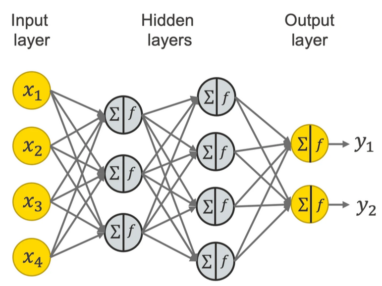

# Ciência de Dados e a Indústria 4.0

Todas as revoluções industriais apresentam drásticas mudanças no cenário produtivo, 
desde a utilização das primeiras máquinas à vapor, a eletrificação, 
a automação (Figura 1) e não seria diferente na sua quarta versão, 
também chamada de Indústria 4.0, em que alguns novos pilares foram inseridos 
transformando o modo interação entre a matéria prima, as máquinas e a mão de obra. 

Todas as inovações agregadas aos processos produtivos trazem grandes desafios, 
afetando o modo de vida em aspectos econômicos, social e cultural de praticamente todo o 
mundo globalizado. 

De acordo com Klaus Schwab, _“Moldar a quarta revolução industrial para garantir que ela 
seja empoderadora e centrada no ser humano – em vez de divisionista e desumana – 
não é uma tarefa para um único interessado ou setor, nem para uma única região, 
ou indústria ou cultura. Pela própria natureza fundamental e global dessa revolução, 
ela afetará e será influenciada por todos os países, economias, 
setores e pessoas”_ (A quarta revolução industrial. São Paulo. Edipro, 2016).

| Figura 1: As revoluções industriais                                     |
| :---------------------------------------------------------------------: |
|                      |
| Fonte: [9 PILARES TECNOLÓGICOS DA INDÚSTRIA 4.0 - OPENCADD](https://www.opencadd.com.br/blog/9-pilares-da-industria-4-0) |

Os pilares que sustentam a quarta revolução industrial, 
de acordo com o *The Boston Consulting Group*, estão ilustrados na Figura 2, 
em que a **Integração de Sistemas** talvez seja um elemento de central importância na 
fusão das tecnologias e seu emprego orquestrado na melhoria da eficiência da produção 
industrial, possibilitando a comunicação de forma horizontal entre equipamentos e 
vertical entre níveis de organização e gestão. 

O uso de **Simulações** em tempo real, 
criando um produto digital ou mesmo uma replica digital de uma máquina ou linha de produção, 
gêmeo digital, testando hipóteses e auxiliando o desenvolvimento e manutenção dos equipamentos.

A customização levada ao nível de um elemento de produção por lote se faz possível, 
principalmente com as técnicas de **manufatura aditiva**, 
trazendo um ganho fenomenal em flexibilidade da produção. 

A **Realidade aumentada** traz um grande potencial, principalmente nos setores de 
manutenção e treinamento, possibilitando inserir sobre o mundo real, 
projeções que servem de informação ou orientação para procedimentos, sejam na área médica, 
educacional ou industrial.

A linha de produção, muitas vezes, composta de robôs autônomos, trazendo maior uniformidade, 
flexibilidade e velocidade para a produção, utilizando parâmetros produzidos por 
algoritmos de inteligência artificial. 

| Figura 2: Pilares do avanço tecnológico                                     |
| :--------------------------------------------------------------------------:|
|                  |
| Fonte: [Transformação Digital na Indústria 4.0 - Fluxo](https://fluxoconsultoria.poli.ufrj.br/blog/industria4/) |

A integração horizontal no chão de fábrica é possível, inclusive, 
devido ao desenvolvimento do que chamado de **Internet das coisas**, 
em que os diversos dispositivos nos diversos níveis hierárquicos no chão de fábrica, 
conseguem se comunicar, prioritariamente através de servidores em **Nuvem**. 
Sendo esses locais centros de armazenamento e processamento do grande volume de dados, 
**Big Data**, em um servidor que não é mais associado fisicamente à fabrica, 
sendo agora um serviço oferecido por outras empresas especializadas em serviços de 
computação em nuvem, retirando essa carga de uma equipe de tecnologia de informação e 
uma central de processamento de dados local, com todos os requisitos de 
disponibilidade e segurança (**Cybersegurança**) sob responsabilidade desses provedores. 

Todo o conjunto massivo de dados é analisado (**Analytics**) através de algoritmos de 
inteligência artificial e produz parâmetros para tomada de decisão de forma a 
interferir nos processos locais ou mesmo corporativos. 

Em todos os processos há produção de dados, que podem ser relevantes ao processo, 
por isso são armazenados e analisados, gerando descobertas e produção de informações 
relevantes à melhoria do processo produtivo. Devido a sua centralidade e importância, 
os dados se tornaram o sinônimo de máteria-prima desta revolução, a era dos dados, 
a era da informação, sendo o seu volume impossível de ser analisado de forma tradicional, 
por cientistas de dados, faz-se necessário desenvolvimento de algoritmos que 
consigam analisar um volume tão grande de dados, de forma a extrair as informações 
relevantes de forma automática, e por isso a grande relevância e importância da 
inteligência artificial e técnicas de aprendizado de máquina tão presentes nas 
tecnologias contemporâneas. 

**Referências e complementos**

1. [Ind4.0 - Manufatura avançada](https://www.industria40.ind.br/)
2. [Código Fonte TV - CEO TROCA TODO TIME DE DEVS POR INTELIGÊNCIA ARTIFICIAL.](https://youtu.be/evVaZeysQKo?si=4Ee1ZUB_Bt8y1-4U)
3. [9 PILARES TECNOLÓGICOS DA INDÚSTRIA 4.0 - OPENCADD](https://www.opencadd.com.br/blog/9-pilares-da-industria-4-0)
4. [Transformação Digital na Indústria 4.0 - Fluxo](https://fluxoconsultoria.poli.ufrj.br/blog/industria4/)

---

## Inteligência Artificial

A proposta inicial para o termo `Inteligência Artificial` foi elaborada em uma 
conferência de um projeto de pesquisa de verão da Universidade de Dartmouth, 
no ano de 1956 com a participação dos cientistas e matemáticos, 
como ilustrado na capa do relatório na Figura 1, 
John McCarthy (Organizador), Marvin Minsky, Nathaniel Rochester e Claude Shannon. 

|               Figura 1 : Uma proposta para o projeto de pesquisa de verão de Dartmouth sobre inteligência artificial               |
| :--------------------------------------------------------------------------------------------------------------------------------: |
|                                                                                                                |
| Fonte: [Artificial Intelligence Coined at Dartmouth](https://home.dartmouth.edu/about/artificial-intelligence-ai-coined-dartmouth) |

A hipótese proposta foi a de que 
"toda característica do aprendizado ou qualquer outra característica da inteligência pode, 
em princípio, ser tão precisamente descrita, que uma máquina pode ser feita para simulá-la". 
Nasceu assim uma nova área de pesquisa, a **Inteligência Artificial (IA)**. 

Ainda na década de 60 foram desenvolvidos o primeiro chatbot ELIZA, 
que imitava um profissional de psicanálise, e Shakey, um robô que unia mobilidade, 
fala e certa autonomia de ação. 

O período compreendido entre meados dos anos 70 e início dos 80, 
ficou conhecido como `Inverno da Inteligência Artificial`, 
por ter havido pouco desenvolvimento da área. 

Nos anos 80 foram desenvolvidas técnicas que permitiram produzir sistemas especialistas, 
capazes de produzir resultados interessantes em tarefas específicas. 
Nasce a **aprendizagem de máquina (*Machine Learning - ML*).**

O aprendizado de máquina - *machine learning* - é um conjunto de técnicas para usar 
algoritmos que analisam dados e 'aprendem' com eles, de modo a tomar uma decisão baseado 
nessa 'experiência'. Desta forma, no lugar de escrever códigos para realizar uma tarefa, 
o algoritmo é treinado com um certo volume de dados significativos para poder, 
após o treinamento, realizar a tarefa baseado no que foi 'aprendido'. 

Várias **técnicas** de *machine learning* surgiram para cumprir objetivos específicos, 
como a aprendizagem por árvore de decisão, programação lógica indutiva, agrupamento, 
aprendizagem por reforço, redes bayesianas, entre outras. 

Uma das melhores aplicações ocorreu com a visão computacional, 
mesmo utilizando muitos códigos manuais para cumprir com o seu objetivo, 
como a utilização de filtros de detecção de bordas, 
filtros para detecção de formas e classificadores para reconhecer caracteres. 
Partindo o resultados desses classificadores, algoritmos conferem sentido às imagens e 
determinam se é o objeto procurado ou não. 

| Figura 2: Linha do tempo das técnicas de inteligência artificial                    |
| :---------------------------------------------------------------------------------: |
|                                    |
| Fonte: [Qual é a Diferença entre Inteligência Artificial, Machine Learning e Deep Learning? 10 de março de 2021 por Michael Copeland - Blog NVIDIA)](https://blog.nvidia.com.br/blog/qual-e-a-diferenca-entre-inteligencia-artificial-machine-learning-e-deep-learning/) |

Geoffrey Hinton, da Universidade de Toronto propôs uma técnica denominada de **Rede Neural**, 
que utiliza o conceitos biológicos de neurônios e suas conexões, 
além de direções de propagação de dados para criar uma rede com camadas de processamento. 
Essa técnica somente se tornou relevante a partir da disponibilidade das 
Unidade de Processamento Gráficos (GPUs). Assim, em 2012, Andrew Ng, no Google, 
fez o reconhecimento de gatos utilizando milhares de vídeos do Youtube para treinar a sua rede, 
desenvolvida com uma maior quantidade de neurônios e camadas, tornando eficaz o seu uso, 
chamando essa técnica de Rede Profunda - **Deep Learning**. 

A Figura 3 ilustra uma rede neural com quatro camadas, sendo uma camada de entrada, 
uma camada de saída e duas camadas ocultas, neste exemplo. 
Redes neurais profundas apresentam mais nós, e mais camadas, 
o que confere uma maior complexidade. 

| Figura 3: Exemplo de representação de Rede Neural                                  |
| :--------------------------------------------------------------------------------: |
|                                               |
| Fonte: [A Friendly Introduction to [Deep] Neural Networks - August 23, 2021 - Kathrin Melcher - KNIME](https://www.knime.com/blog/a-friendly-introduction-to-deep-neural-networks) |

**Níveis de técnicas e ferramentas**

A inteligência artificial tornou-se um termo muito amplo, 
e abarca um grande conjunto de ferramentas, incluindo `Machine Learning` e `Deep Learning`, 
como ilustrado na Figura 4. Sua aplicação, da mesma forma, 
é muito vasta e está cada vez mais presente no cotidiano das empresas nos mais diversos 
segmentos, tais como setor financeiro, industrial, comercial, científicos, 
entre outros, em aplicações como a filtragem de spam, análise de crédito, 
diagnóstico médico, reconhecimento facial, recomendações, chatbots, anúncios direcionados, etc.

Para trabalhar com tomada de decisão baseada em dados, 
profissionais cada vez mais especializados são demandados. 
De início foram adaptados profissionais como estatísticos e programadores, 
até a difusão de profissionais como Cientistas de Dados, 
que simplificadamente executam a fusão das duas áreas, aplicando técnicas estatísticas 
para realizar análises de dados, através de ferramentas de informática ou 
linguagens de programação, de modo a produzir análises preditivas. 
Conhecer a área de análise/negócio também é fundamental para a qualidade do resultado. 

A Figura 4 ilustra a área de ciência de dados interseccionando todos os níveis de ferramentas, 
podendo executar tarefas que necessitem de técnicas de inteligência artificial, 
*machine learning* ou mesmo de *deep learning*. 

| Figura 4: Ferramentas de um Cientista de Dados                                   |
| :------------------------------------------------------------------------------: |
|                                     |
| Fonte: [Qual a Diferença Entre Cientista de Dados e Engenheiro de Machine Learning? 31 de Outubro de 2024 - Data Science Academy](https://blog.dsacademy.com.br/qual-a-diferenca-entre-cientista-de-dados-e-engenheiro-de-machine-learning/) |

Com o aumento da demanda de trabalho, as equipes que trabalham com dados vão se 
especializando e produzindo novos cargos, como Engenheiro de dados e Engenheiro de 
Machine Learning. Enquanto o primeiro é o responsável por todo o processo de 
transporte de dados, desde sua aquisição, limpeza, armazenamento e 
disponibilização dos dados para serem analisados pelos algoritmos e a entrega dos 
resultados aos gestores do setor ou da empresa. 
Já o Engenheiro de Machine Learning é responsável por escolher e implementar a melhor 
técnica a ser utilizada para resolver os problemas propostos. 

A Figura 5 ilustra a busca do termo `Engenheiro de Machine Learning` no Google trends, 
mostrando os países em que tal termo é mais buscado bem como seu incrível crescimento, 
haja visto que uma década atrás essa demanda não existia. 

| Figura 5: Busca por Engenheiro de Machine Learning |
| :------------------------------------------------: |
|     |
|                Fonte: Google Trends                |

A inteligência artificial é cada vez mais presente e tem perspectiva de um 
crescimento ainda maior para os próximos anos, o que garante a necessidade de 
conhecer e aprender ferramentas que possam servir de apoio a sua área de trabalho, 
seja ela qual for, mas em especial atenção no setor industrial e educacional, 
setor ao qual estamos ligados. 

**Referências e complementos**

1. [Artificial Intelligence Coined at Dartmouth](https://home.dartmouth.edu/about/artificial-intelligence-ai-coined-dartmouth)
2. [Qual é a Diferença entre Inteligência Artificial, Machine Learning e Deep Learning? 10 de março de 2021 por Michael Copeland - Blog NVIDIA)](https://blog.nvidia.com.br/blog/qual-e-a-diferenca-entre-inteligencia-artificial-machine-learning-e-deep-learning/)
3. [A história da inteligência artificial - TecMundo](https://www.tecmundo.com.br/mercado/135413-historia-inteligencia-artificial-video.htm)
4. [O que é aprendizado de máquina (ML)? - IBM](https://www.ibm.com/br-pt/topics/machine-learning)
5. [A Friendly Introduction to [Deep] Neural Networks - August 23, 2021 - Kathrin Melcher - KNIME](https://www.knime.com/blog/a-friendly-introduction-to-deep-neural-networks)

---

## Análise de Dados

A análise de dados é o processo de manipulação de dados através de ferramentas computacionais e estatísticas, de modo a buscar informações relevantes que auxiliam à tomada de decisão. 

São basicamente quatro os tipos de análise de dados:

1. Descritiva
2. Diagnóstica
3. Preditiva
4. Prescritiva

Eles são usadas em função do objetivo da análise e do conjunto de dados que se está 
trabalhando, começando pela avaliação do problema de negócio, 
em que são realizadas perguntas tais como:

1. O resultado da ação foi positivo ou negativo?
2. Por que os resultados foram esses?
3. Como tomar uma decisão?
	
Após a definição do problema que será estudado, 
deve-se **descrever** o comportamento dentro de um escopo bem definido, 
**diagnosticar** os motivos que produziram os comportamentos. 
Daí seguem etapas mais complexas, costumeiramente desenvolvidas por cientistas de dados, 
que envolver processos de **prever** o comportamento baseado em histórico e 
por fim **prescrever**/orientar ações para alcançar as metas do negócio. 
Estas duas últimas etapas são mais complexas, envolvem um ferramental estatístico 
mais avançado e técnicas de aprendizado de máquina. 

A Figura 1 ilustra um fluxo para análise de dados, 
que segue desde a análise descritiva até a prescritiva, porém, 
não é necessária a realização de todo o fluxo de análise, 
pois tudo depende da finalidade da análise. 

| Figura 1: Fluxo de análise de dados               |
|:-------------------------------------------------:|
||
| Fonte: Autor                                      |

A divisão entre analista e cientista é uma tendência, não uma obrigatoriedade, 
apenas uma separação em função do nível de aplicação de técnicas de análise. 

**Análise Descritiva**

Fornece um resumo simples de uma planilha de dados, 
através de **indicadores, gráficos e tabelas**. 
Realiza a exploração inicial dos dados, permitindo a compreensão da distribuição, 
valor central e dispersão dos dados, além da presença de possíveis _outliers_.

São características da Análise Descritiva:

1. Resumo de dados:
	1. Medidas de tendência central: Média, Moda e Mediana;
	2. Medidas de dispersão: Desvio padrão e Variância.
2. Visualização de dados:
	1. Relação entre variáveis.
3. Identificação de padrões.

As principais ferramentas utilizadas na análise descritiva são:

1. Planilhas de cálculo: Excel, Google Sheets;
2. Softwares estatísticos: SPSS, Stata;
3. Softwares de visualização de dados: Tableu, Power BI;
4. Linguagens de programação: Python e R.

**Análise Diagnóstica**

Busca entender os motivos ou causas por trás de determinado fenômeno ou resultado. 
Procura responder à pergunta "por quê?", busca identificar padrões e relações 
nos dados que podem explicar mudanças ou tendências observadas e ainda pode 
envolver a consideração de fatores externos ou internos.

São características da análise diagnóstica:

1. Investigativa:
	* Buscando entender as causas subjacentes de um fenômeno ou problema.
2. Baseada em Hipóteses:
	* Uma hipótese é proposta e a análise é usada para testar ela. 
3. Uso de dados históricos:
	* Identificar tendências, padrões e relações que podem explicar os resultados atuais.
4. Análise Multivariada:
	* Pode envolver múltiplas variáveis ao mesmo tempo para entender as interações complexas que podem estar influenciando um resultado
5. Interpretação cuidadosa

As principais ferramentas utilizadas na análise diagnóstica são: 

1. Análise de regressão: Identificar a relação entre variáveis dependentes e independentes;
2. Análise de correlação: Determinar a relação entre duas ou mais variáveis;
3. Análise de *cluster*: Agrupa por características semelhantes;
4. Análise de causa e efeito (Diagrama de Ishikawa): Proporciona uma visão ampla e identificação de possíveis causas de um problema.

**Análise Preditiva**

Análise estatística que tem como objetivo prever resultados futuros com base em 
dados históricos e técnicas de modelagem. O processo geralmente envolve a coleta de dados, 
o desenvolvimento de um modelo estatístico e  a previsão de resultados futuros com 
base nesse modelo. Esses modelos podem ser simples, envolvendo apenas algumas variáveis, 
ou extremamente complexos, envolvendo muitas variáveis e relações interdependentes.

São características da análise preditiva:

1. Baseada em modelos: Estatísticos e de *Machine Learning*.
2. Usa histórico de dados: Treinamento dos modelos.
3. Multivariável: Consideram a interação entre muitas variáveis para previsões.
4. Preditiva, mas não infalível: Sempre há um grau de incerteza. 
5. Orientada para a ação: Resultados orientam a tomada de decisão.

As principais ferramentas utilizadas na análise preditiva são:

1. Python: Juntamente com bibliotecas como Pandas, NumPy, Sci-kit Learn
2. R: Análise estatística e gráficos, principalmente no meio acadêmico e pesquisa.
3. SAS: *Statistical Analysis System*, muito usado em setores financeiro e saúde.
4. SPSS: Software de fácil usabilidade e com ampla gama de ferramentas disponíveis.
5. Excel: Aplicado quando não se requer técnicas estatísticas avançadas. 

**Análise Prescritiva**

Fornece recomendações sobre o que deve ser feito, utilizando **técnicas avançadas** 
que levam em consideração uma **variedade de cenários** e **possíveis resultados**, 
para ajudar os tomadores de decisão a entender as implicações de diferentes cursos de ação. 

São características da análise prescritiva:

1. Recomendações de ação;
2. Consideração de diferentes cenários;
3. Otimização de operações;
4. Auxílio à tomada de decisão;
5. Adaptação a mudanças nas condições: pode incorporar novos dados à medida que se tornem disponíveis.

As principais ferramentas da análise prescritiva são:

1. Softwares de modelagem: Python, R, SAS, SPSS
2. Ferramentas de otimização: Gurobi, CPLEX
3. Ferramentas de simulação: Simul8, AnyLogic
4. Ferramentas de visualização de dados: Tableau, Power BI
5. Plataformas de *machine learning*: Azure ML, Amazon SageMaker

Exemplo de análise preditiva: 

[Kaggle - Forecasting Future Passengers w/ PyCaret](https://www.kaggle.com/code/caesarmario/forecasting-future-passengers-w-pycaret)

---

## Aulas TAA

| Aula |Título | Conteúdo  | Material complementar |
| :--: | ----- | --------- | --------------------- |
|    0 | [Apresentação da disciplina](dados/slides/Aula00-apresentacao.pdf) |- Ementa;   - Objetivos   - Conteúdo programático   - Bibliografia   - Avaliação | [Engenharia de Controle e Automação - PPC 2029](https://nextcloud.slt.ifsp.edu.br/nextcloud/index.php/s/n7YQrbWs9K9cEwL) |
| 1 | [Aula 01 - Indústria 4.0](dados/slides/Aula01-Industria4_0.pdf) | - Revoluções Industriais   - Pilares tecnológicos | 1. [Ind4.0 - Manufatura avançada](https://www.industria40.ind.br/)   2. [Código Fonte TV - CEO TROCA TODO TIME DE DEVS POR INTELIGÊNCIA ARTIFICIAL.](https://youtu.be/evVaZeysQKo?si=4Ee1ZUB_Bt8y1-4U)   3. [9 PILARES TECNOLÓGICOS DA INDÚSTRIA 4.0 - OPENCADD](https://www.opencadd.com.br/blog/9-pilares-da-industria-4-0)   4. [Transformação Digital na Indústria 4.0 - Fluxo](https://fluxoconsultoria.poli.ufrj.br/blog/industria4/)   5. [A história da inteligência artificial - TecMundo](https://www.tecmundo.com.br/mercado/135413-historia-inteligencia-artificial-video.htm) |
| 2 | [Aula 02 - Inteligência Artificial](dados/slides/Aula02-InteligenciaArtificial.pdf) | - Inteligência Artificial   - Machine Learning   - Redes Neurais | 1. [Artificial Intelligence Coined at Dartmouth](https://home.dartmouth.edu/about/artificial-intelligence-ai-coined-dartmouth)   2. [Qual é a Diferença entre Inteligência Artificial, Machine Learning e Deep Learning? 10 de março de 2021 por Michael Copeland - Blog NVIDIA)](https://blog.nvidia.com.br/blog/qual-e-a-diferenca-entre-inteligencia-artificial-machine-learning-e-deep-learning/)   3. [A história da inteligência artificial - TecMundo](https://www.tecmundo.com.br/mercado/135413-historia-inteligencia-artificial-video.htm)   4. [O que é aprendizado de máquina (ML)? - IBM](https://www.ibm.com/br-pt/topics/machine-learning)   5. [A Friendly Introduction to [Deep] Neural Networks - August 23, 2021 - Kathrin Melcher - KNIME](https://www.knime.com/blog/a-friendly-introduction-to-deep-neural-networks) |
| 3 | [Ciência de Dados](dados/slides/Aula03-CienciadeDados.pdf) | - Análise de dados   - Tipos de Análise de dados   - Análise Descritiva   - Análise Diagnóstica   - Análise Preditiva   - Análise Prescritiva | 1. [Kaggle - Forecasting Future Passengers w/ PyCaret](https://www.kaggle.com/code/caesarmario/forecasting-future-passengers-w-pycaret)   2. [Esses são os 5 PASSOS para fazer uma ANÁLISE DE DADOS - Comunidade DS](https://youtu.be/-zHK3e45cI8?si=mk_jM-flgaAbkbJq)   3. [Data Viking - Odemir Depieri Jr](https://www.dataviking.com.br/post/tipos-de-analise-de-dados) |

---
