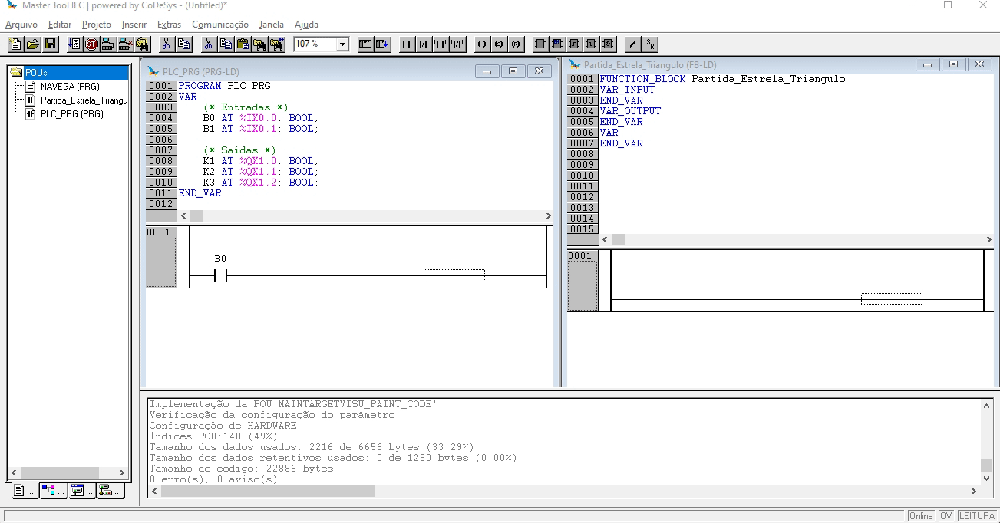

# Projeto: Partida Estrela Triângulo

## 1. Declaração de entradas e saídas físicas no programa principal:

## 2. Adicionando um bloco funcional (*function block*):

## 3. Adicionando variáveis no bloco funcional:

## 4. Adicionando o bloco funcional ao programa principal:

## 5. Programando o comportamento do bloco funcional:

## 6. Baixando o programa para o PLC:

## 7. Executando o programa no PLC:

