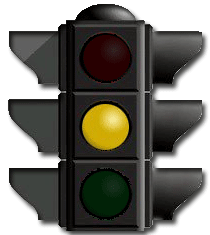

# Projeto: Semáforo

## 1. Situação de aprendizagem: Semáforo

### 1.1 Objetivo

Desenvolver uma aplicação, programa de PLC, 
para um dispositivo de controle de tráfego (semáforo), 
a ser instalado em um cruzamento de pedestre.

### 1.2 Requisitos

* Intervalo de tempo para o Semáforo de Veículos(sv):
	* Verde: 42s
	* Amarelo: 3s
	* Vermelho: 15s
* Semáforo de Pedestre(sp) sincronizado com o de veículos:
	* Verde (sv) : Vermelho (sp)
	* Amarelo (sv) : Vermelho (sp)
	* Vermelho (sv) : Verde (sp)
* Piscar Vermelho (sp) 3x antes de mudar em definitivo.

* Botão pulsador para antecipar liberação de passagem dos pedestres:
	* Se faltar mais do que 10s para o acionamento da cor amarela, reduzir para 10s.
	* Se faltar menos do que 10s para o acionamento da cor amarela, manter o tempo restante.

### 1.3 Planejamento

Definir como será feita a entrega: 
simulador, montagem de protótipo, montagem de circuito em painel ou PCI, etc, 
assim como listar os materiais e ferramentas em função do tipo de entrega. 
Por fim o planejamento do processo, em que deve ficar explicito como, 
utilizando os materiais listados e manipulando da ferramentas, 
chega-se ao produto final, com um encadeamento lógico das tarefas que compoem o processo.

### 1.4 Solução

