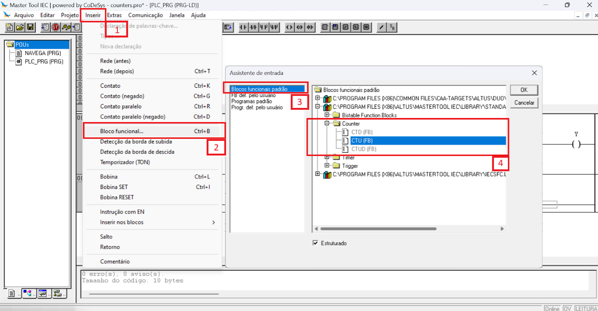
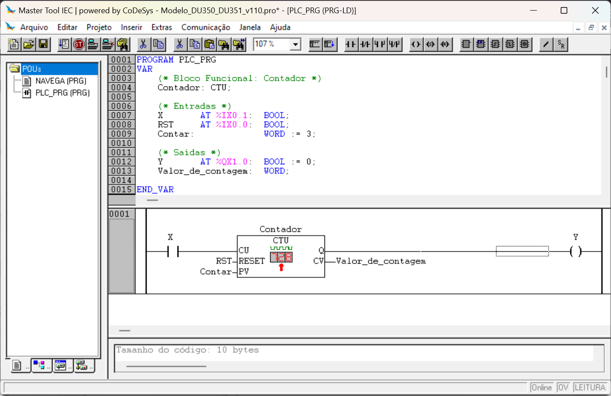
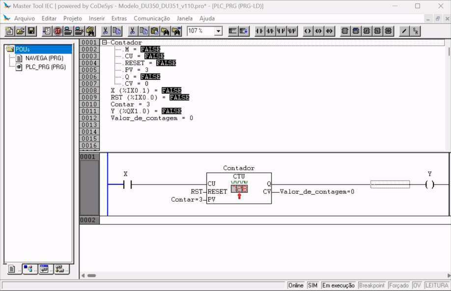
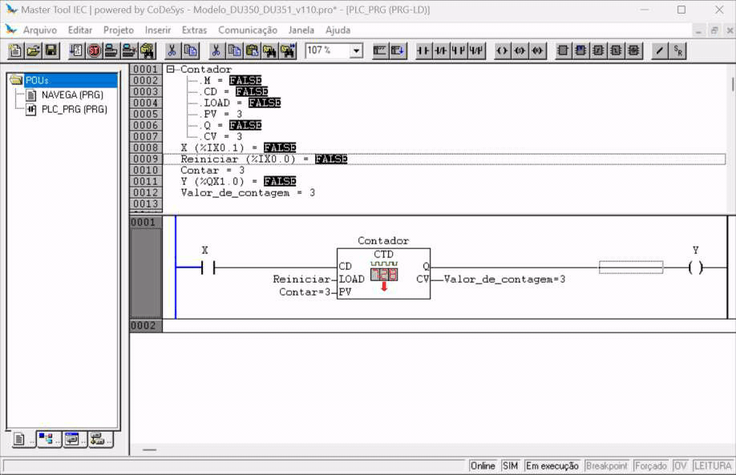
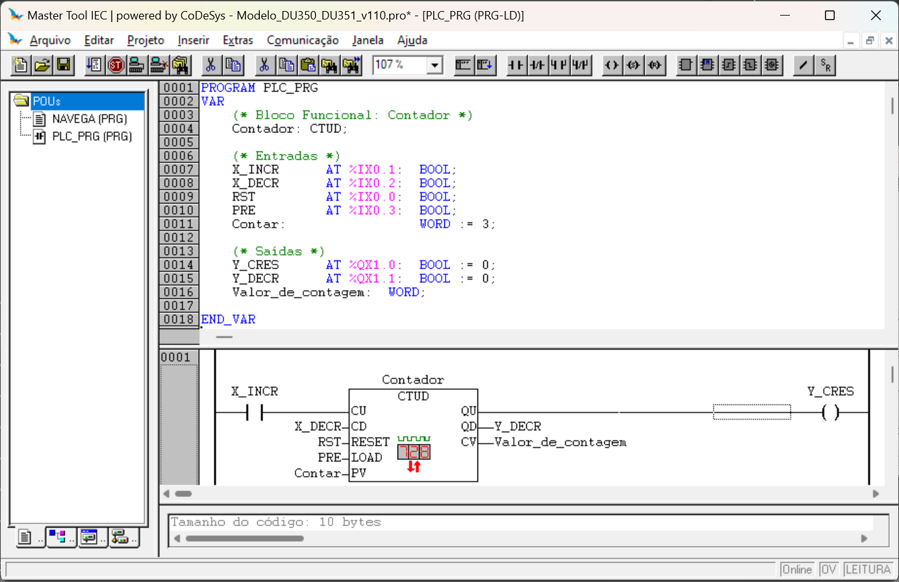
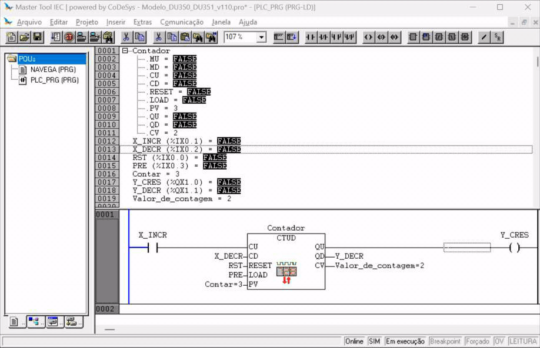

# Contadores

## 1. Inserir Bloco Funcional Contador

## 2. Contador Crescente - *Counter UP*

## 3. Contador Decrescente - *Counter DOWN*

## 4. Contador Crescente/Decrescente - *Counter UP/DOWN*

