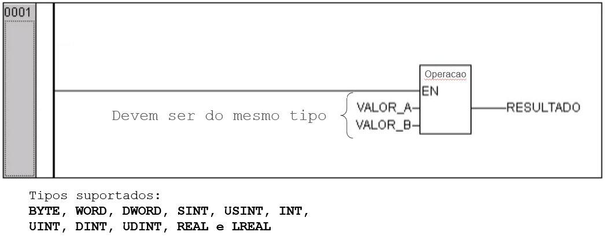
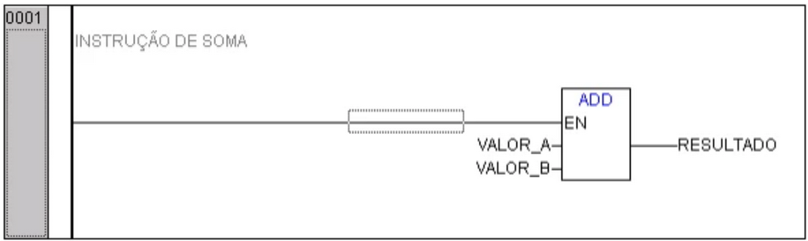
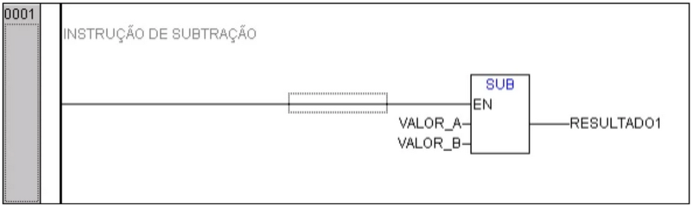

---
title: Blocos Funcionais Úteis
icon: fontawesome/solid/object-ungroup
authors:
 - José W. R. Pereira
tags:
 - CLP
 - Altus
 - TB131
 - Blocos Funcionais Úteis
 - Operações Aritméticas
 ---

# Inserir Blocos Funcionais Aritméticos

Funções: ADD, SUB, MUL, DIV, MOD

## 1. Função ADD - Adição

## 2. Função SUB - Subtração

## 3. Função ADD/SUB TIME - Adição e Subtração de tempo

## 4. Função MUL - Multiplicação

## 5. Função DIV - Divisão

## 6. Função MOD - Módulo - Resto da Divisão

