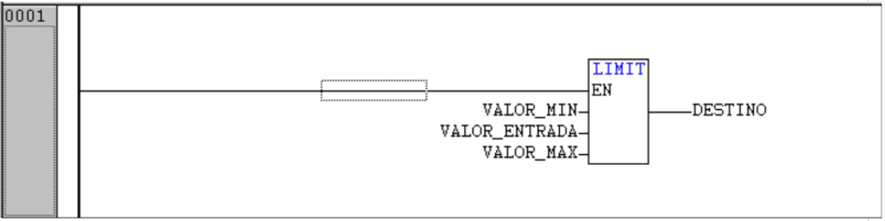
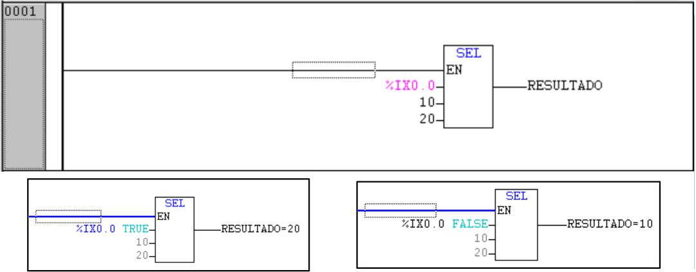
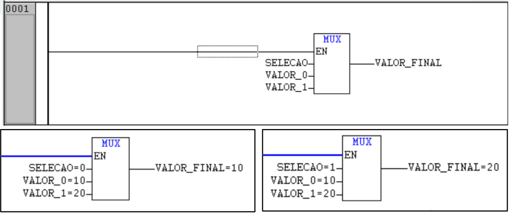

---
title: Blocos Funcionais Úteis
icon: fontawesome/solid/object-ungroup
authors:
 - José W. R. Pereira
tags:
 - CLP
 - Altus
 - TB131
 - Blocos Funcionais Úteis
 - Operações Seleção
 ---

# Inserir Blocos Funcionais de Seleção

Funções: MOVE, MIN, MAX, LIMIT, SEL, MUX

## 1. Função MOVE - Mover

## 2. Função MIN - Menor valor

## 3. Função MAX - Maior valor

## 4. Função LIMIT - Limitadores

## 5. Função SEL - Seleção

## 6. Função MUX - Multiplexação

