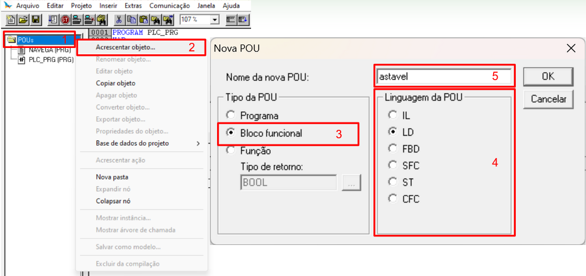
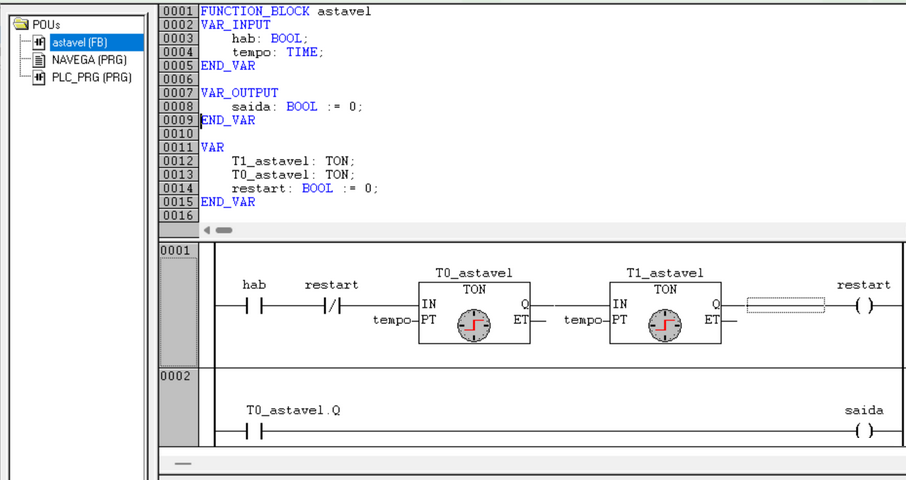
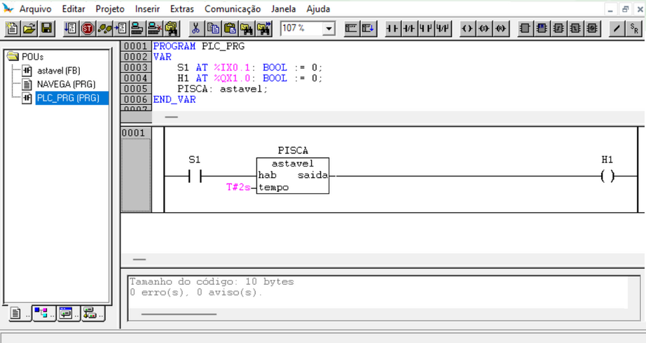

# Criando um Bloco Funcional - *Function Block*

## 1. Criando um Bloco Funcional

## 2. Declaração de Bloco Funcional

## 3. Inserindo o Bloco Funcional no programa principal

## 4. Bloco Funcional no programa principal

