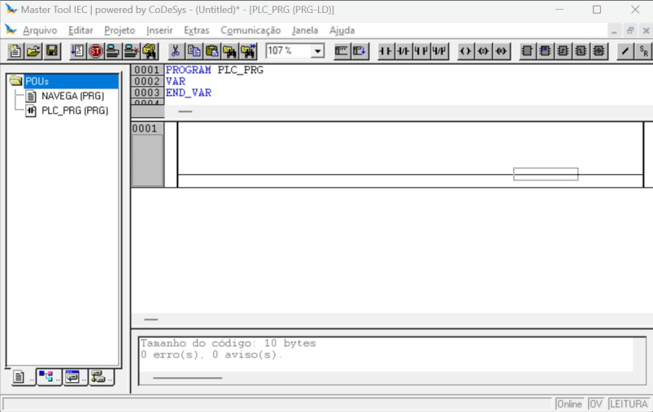
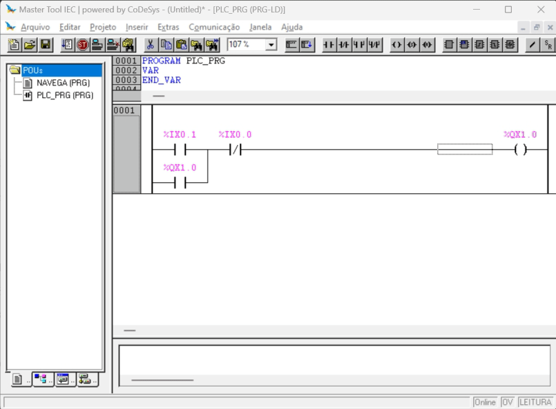

# Criando un novo projeto

## 1. Criando um novo projeto a partir de um modelo: 

## 2. Acrescentando um objeto do tipo `Programa` em linguagem `Ladder`: 

## 3. Programar e compilar um acionamento de bobina com contato de selo

## 4. Simular programa

* Observação:
    1. Um duplo click para indicar a mudança de estado do elemento
    2. Pressione `Ctrl+F7` para efetivar/confirmar a mudança.

