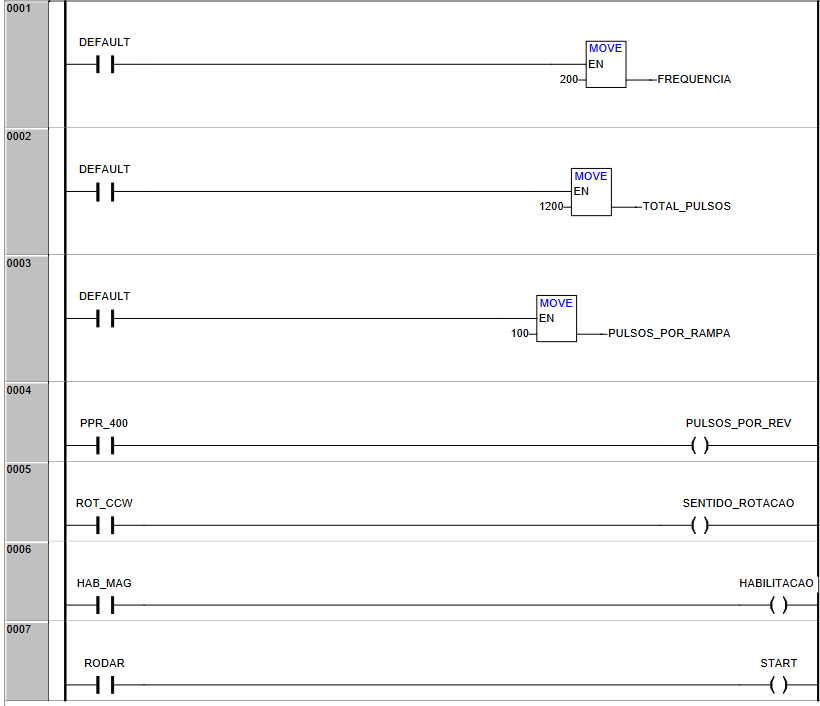

# Motor de Passo e Encoder

## 1. Configuração de Saída Rápida para *Pulse Train Output*


## 2. Configuração de Entrada Rápida 


## 3. Declaração de variáveis

``` Pascal
PROGRAM PLC_PRG
VAR
	(* Registradores do Motor de Passo *)
	FREQUENCIA 			AT %MD1652: DWORD;	  (* Frequência do sinal de saída *)
	TOTAL_PULSOS 		AT %MD1653: DWORD;	  (* Número total de pulsos *)
	PULSOS_POR_RAMPA	AT %MD1654: DWORD;	  (* Número de pulsos por rampa de aceleração e desaceleração*)
	START 				AT %MX3314.2: BOOL;	  (* Aciona o disparo de pulsos *)
	SENTIDO_ROTACAO 	AT %QX0.2: BOOL := 0; (* Sentido = 0:Horário / 1:Anti-horário *)
	HABILITACAO 		AT %QX0.3: BOOL := 0; (* Bobinas = 0:Não Energizadas / 1:Energizadas *)
	PULSOS_POR_REV		AT %QX0.4: BOOL := 0; (* PULSOS POR REVOLUÇÃO = 0:200 / 1:400 *)

	(* Interface *)
	DEFAULT				AT %IX0.0: BOOL := 0; (* Inicializa os registradores com os valores padrão *)
	PPR_400				AT %IX0.1: BOOL := 0; (* Ativa 400 ppr (valor padrão: 200) *)
	ROT_CCW				AT %IX0.2: BOOL := 0; (* Ativa sentido de rotação anti-horário *)
	HAB_MAG				AT %IX0.3: BOOL := 0; (* Energiza as bobinas do motor *)
	RODAR				AT %IX0.7: BOOL := 0; (* Dispara rotação *)

	(* Registradores do Encoder *)
	CONTAGEM_ENCODER 	AT %MD1633: DWORD;	  (* Valor da contagem do Encoder *)
	ZERA_CONTAGEM		AT %IX1.2: BOOL := 0; (* Zera contagem do Encoder *)

END_VAR
```

## 4. Programa de teste em Diagrama Ladder




