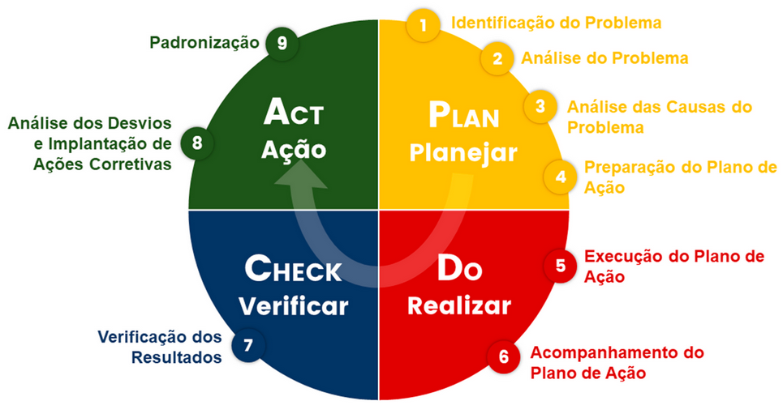
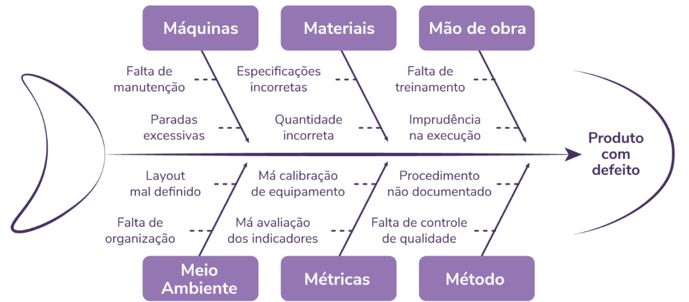
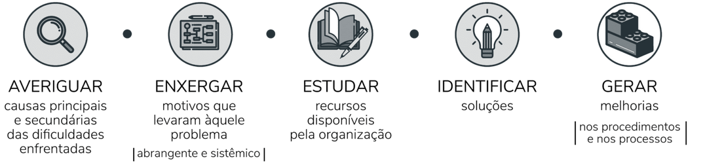
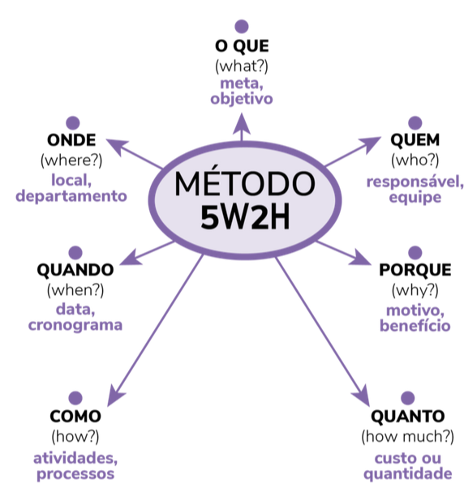
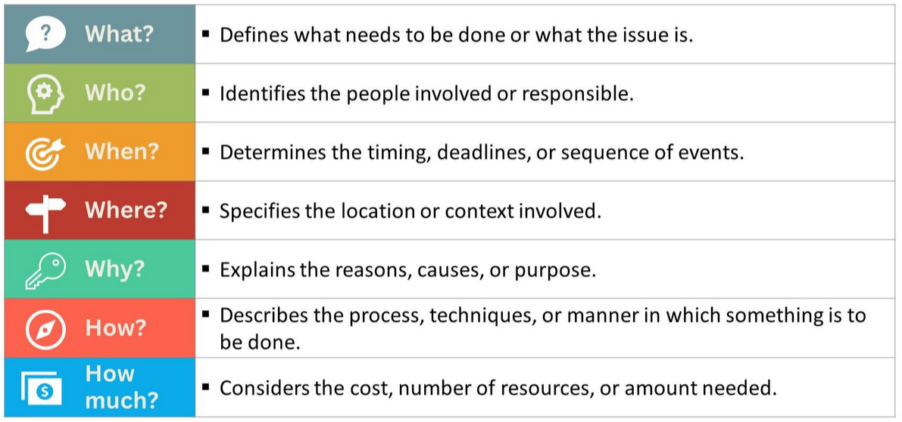

# Ferramentas da Qualidade
---

| Análise SWOT (FOFA)                           |
|:---------------------------------------------:|
|                |
| Fonte: [AbriMinhaEmpresa](https://abriminhaempresa.com/swot-exemplo-e-dicas-incriveis-de-como-fazer/) |

**Complemento**

1. [Matriz SWOT: conceito e aplicação em planejamentos estratégicos - Runrun.it Blog](https://blog.runrun.it/matriz-swot/)

2. [The SWOT analysis, explained - BiteSize Learning](https://www.bitesizelearning.co.uk/resources/swot-analysis-explained-examples-templates)

---

| Ciclo PDCA                          |
|:-----------------------------------:|
|       |
| Fonte: [RHEIS Consulting](https://www.rheis.com.br/post/o-que-%C3%A9-pdca) |

---

| Diagrama de Ishikawa                      |
|:-----------------------------------------:|
|  |
| Fonte: [Keeps](https://keeps.com.br/diagrama-de-ishikawa-o-que-e-e-como-desenvolver/) |

| Utilização do diagrama de Ishikawa            |
|:---------------------------------------------:|
|  |
| Fonte: [Keeps](https://keeps.com.br/diagrama-de-ishikawa-o-que-e-e-como-desenvolver/) |

---

| 5W2H                                          |
|:---------------------------------------------:|
|                       |
| Fonte: [Keeps](https://keeps.com.br/5w2h-o-que-e-como-aplicar-e-por-que-usar/) |

| 5W2H                                          |
|:---------------------------------------------:|
|                |
| Fonte: [StrategyPunk](https://www.strategypunk.com/the-5w2h-method-a-simple-framework-for-asking-the-right-questions-free-ppt/) |

---

